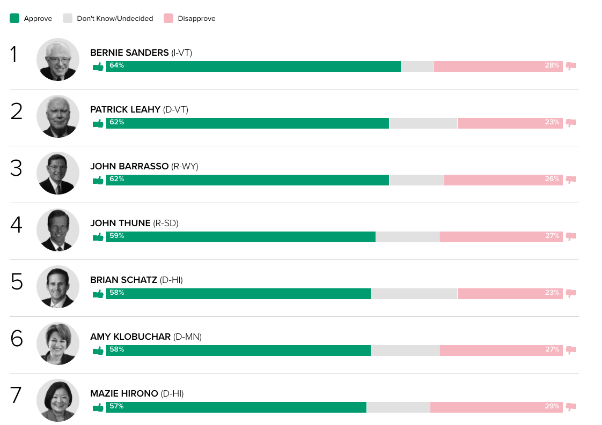
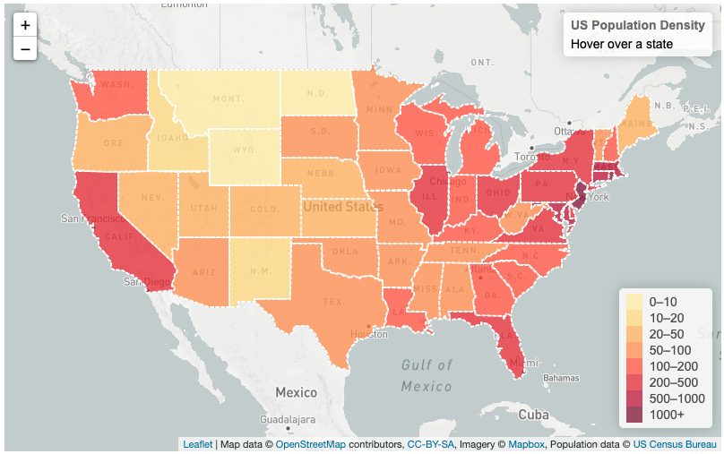

# GeorgiaTech Bootcamp Project 2 

## Project Webpage

[Know your Senator](https://sai-praneeth-reddy.github.io/GT_US_Senate/)

## Web Visualization of current US Senators

## Team Members: 
[Ana Cifuentes](https://www.linkedin.com/in/anacifuentesco/?locale=en_US)  
[Cornelia Harris](http://www.linkedin.com/in/corneliaharris)  
[Lingzi Xiaoli](https://www.linkedin.com/in/lingzi-xiaoli-27b87174)  
[Rachael Munyua](http://www.linkedin.com/in/rachael-munyua)  
[Sai Reddy](https://www.linkedin.com/in/saipraneeth1/)  
[Vinh Phan](https://github.com/vn0707/)  

## Summary : 
The goal of this project is to create a dashboard of the current US Senate, in order to display the performance of the senators. The purpose of the project is to provide necessary information to voters in order to empower them to make informed choices.

## Scope: 
The dashboard will display information which we deem necessary in evaluation of each senator’s performance. We will display senators’ voting records on various bills, approval rates, ratings from advocacy organizations, bills sponsored, as well as ideology scores in their respective states.

## Technologies:
HTML/CSS & Java Script for web page design.  
Bootstrap library for user interaction.  
Python for manipulating data into required format.  
Beautiful soup library for web scraping.  
Flask-Powered RESTful API.  
D3.JS, Plotly, Leaflet & Highcharts libraries for graphs.  
SQL & MongoDB for data storage.  

## Data Sets:
Senators info : [Current Senators Info API](https://www.govtrack.us/api/v2/role?current=true&role_type=senator)  
Popularity: [Senate Popularity Data Source](https://morningconsult.com/2019/01/10/americas-most-and-least-popular-senators-q4-2018-2/)  
Senator Score: [Senator Ideology Score](https://www.govtrack.us/congress/members/report-cards/2019/senate/ideology)  
Crime Rate: [Crime Rate Data](https://worldpopulationreview.com/state-rankings/crime-rate-by-state) 
Poverty Rate: [Poverty Rate Data](https://worldpopulationreview.com/state-rankings/poverty-rate-by-state) 

## Project Location:  
[GitHub Project Repository](https://github.com/sai-praneeth-reddy/GT_US_Senate.git)

## Inspired Visualizations

### 1. Contact Card

### 2. Stacked BarChart

### 3. Map

